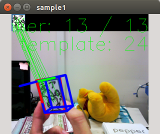

# PointPoseExtractor



  Calcute object pose compared to template. 

## Subscribing Topic

- `/ImageFeature0D` (`posedetection_msgs::ImageFeature0D`)

  Image, camera and tempalte feature information. 

## Publishing Topic

- `/ObjectDetection` (`posedetection_msgs::ObjectDetection`)

  Detected object pose with time stamp. 

- `/ObjectDetection_agg` (`posedetection_msgs::ObjectDetection`)

  Detected object pose with time stamp. 

- `/object_pose` (`geometry_msgs::PoseStamped`)

  Detected Object Pose. 

- `/debug_image` (`cv_bridge::CvImage`) 

  Output image for debug.

## Service 

- `/SetTemplate` 

  Used to add another template.

## Sample

``` 
roslaunch jsk_perception point_pose_extractor.test  
rostopic echo /ObjectDetection
```

### Example of how to run set_template service 

```
#!/usr/bin/env python
# -*- coding: utf-8 -*-

import cv2

import cv_bridge
import rospy
from jsk_perception.srv import SetTemplate, SetTemplateRequest

rospy.init_node('point_pose_extractor_sample')

client = rospy.ServiceProxy('SetTemplate', SetTemplate)
rospy.sleep(1)

req= SetTemplateRequest()

im = cv2.imread('../../sample/ros_diamondback.jpg')
bridge = cv_bridge.CvBridge()
imgmsg = bridge.cv2_to_imgmsg(im, encoding='bgr8')
imgmsg.header.frame_id = 'dummy_camera'
imgmsg.header.stamp = rospy.Time.now()

req.type = 'img0001'
req.image = imgmsg
req.dimx = 0.1
req.dimy = 0.05
req.savefilename = 'img0001.png'
res = client.call(req)
print(res)
```